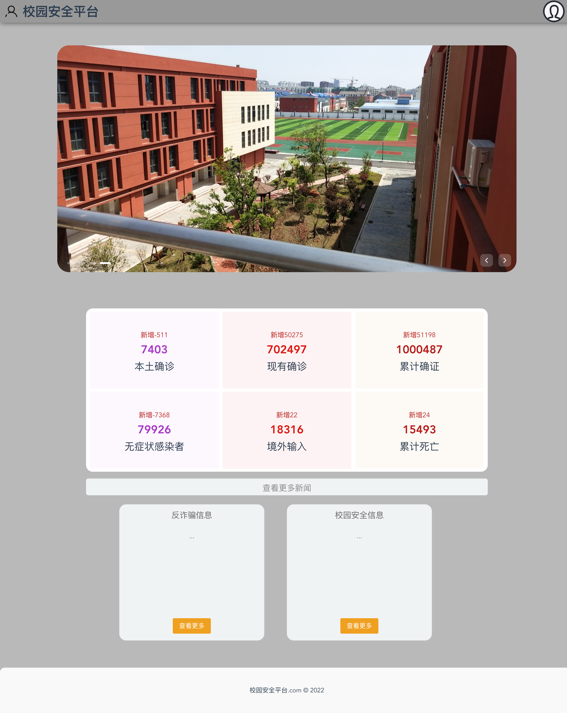
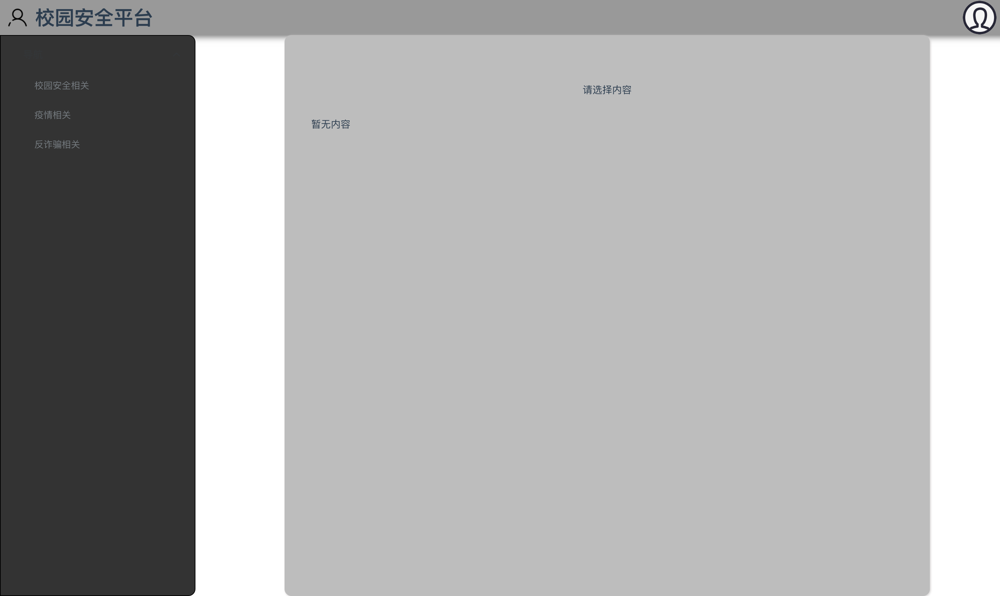
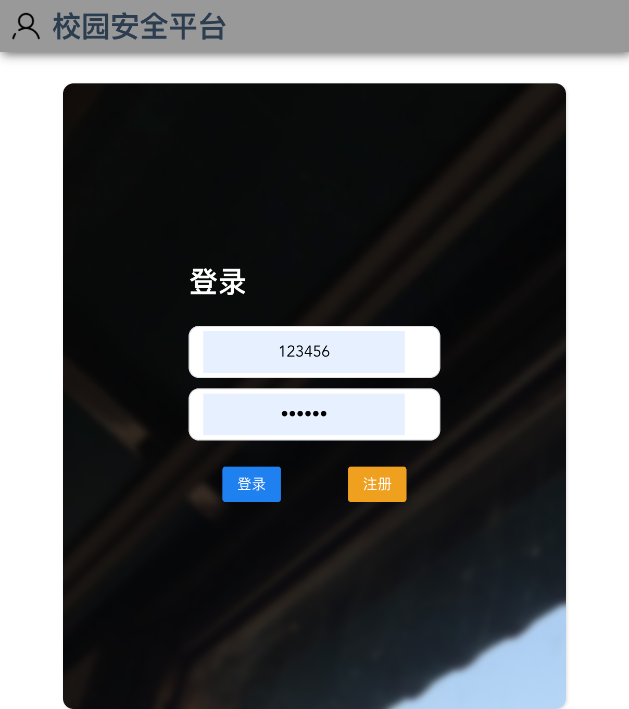
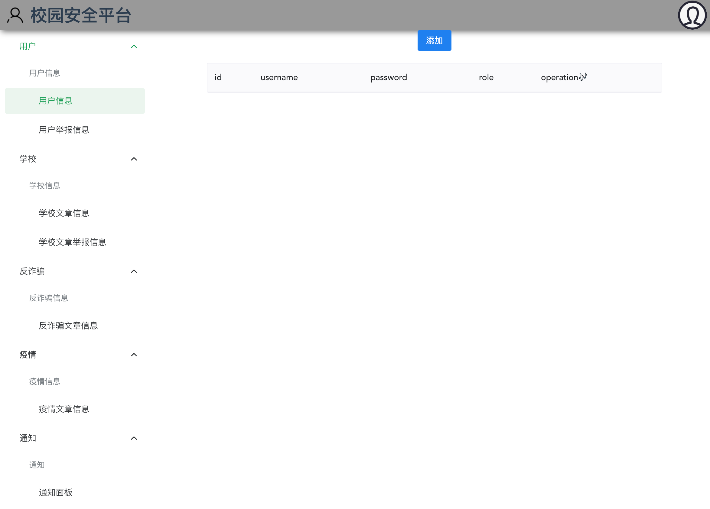

# school-security
> 一个垃圾写的vue3 + ts + vite项目
+ 单纯为了接单用，所以该封装的地方没有封装，该抽离的没有抽离，很差！！！
+ 如果你为了应付倒是可以用用
+ 记得自己把接口写成自己的或者静态数据即可
+ 首页

## 页面
+ 首页

+ 详细页

+ 登陆页

+ 管理员页面

## 运行
1. `git clone` or 下载下来
2. npm i 活着 pnpm i(我喜欢✨)
3. `npm run dev` or `pnpm dev`